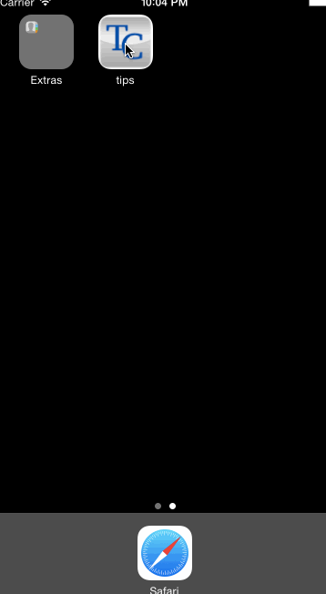

Tips
====

For tip calculator project. The app is called "TC". This is a tip calculator app for iPhones running iOS7 or above. The user can calculate the total of a bill based on the bill's' amount plus a tip of either 18%, 20%, or 22%.

Time Spent: 3 hours total

* [x] Required: Clicking on text field pulls up keyboard, which is a decimal pad
* [x] Required: Clicking anywhere on screen removes keyboard
* [x] Required: Users can select different percentage options (by using segmented controls) and see the total calculated automatically
* * [x] Required: Gif walkthrough of the app

